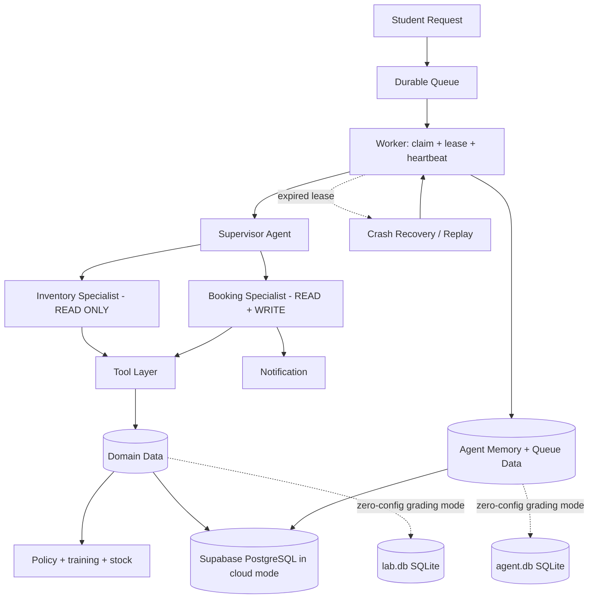

# System Architecture — Lab Equipment Booking Agent

## Execution modes
- **Clean-machine/offline grading:** two SQLite databases, scripted models, no API key.
- **Instructor cloud mode:** `SUPABASE_DB_URL` selects Supabase PostgreSQL; both domain data and durable agent data are persisted in the cloud. The SQLite schema files remain the canonical assignment structures.

## Durable flow
A question is persisted before execution. A worker claims it with a lease. The Supervisor delegates discovery to a read-only Inventory Specialist and actions to a Booking Specialist. Policy is read from data and rechecked inside write tools. Every side effect receives a deterministic idempotency key. If a worker dies, another worker reclaims the expired run and safely replays it without duplicating the booking or notification.
