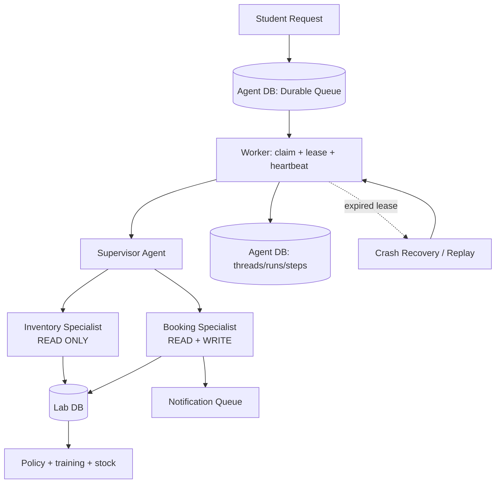

# System Architecture — Lab Equipment Booking Agent

## Flow
1. A student question is persisted in the Agent DB before execution.
2. A worker claims the run with a time-limited lease.
3. The Supervisor delegates discovery to the read-only Inventory Specialist and actions to the Booking Specialist.
4. Booking policy is read from data and rechecked inside the write tool.
5. Every write uses a deterministic idempotency key. If a worker dies, a second worker can reclaim the expired run and safely replay it.
6. Results and model/tool steps are persisted so execution is auditable and resumable.
